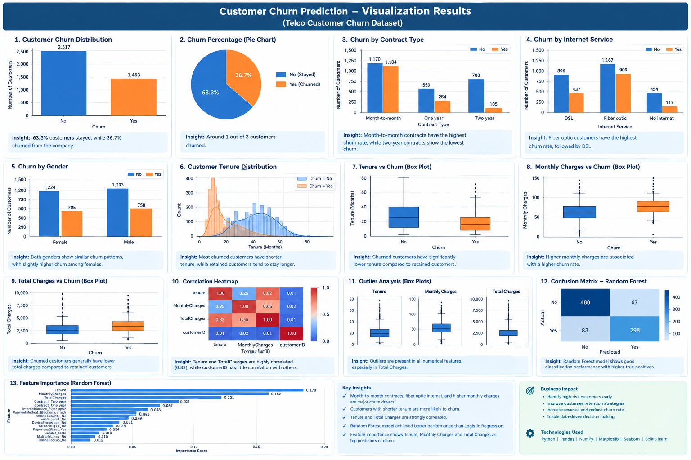

# Customer Churn Prediction using Machine Learning

## Project Overview

This project focuses on predicting customer churn for a telecommunications company using Machine Learning techniques. The workflow covers the complete Data Science lifecycle, including data cleaning, preprocessing, exploratory data analysis (EDA), visualization, feature engineering, model building, evaluation, and feature importance analysis.

The objective is to identify customers who are likely to leave the service, enabling businesses to take proactive retention measures.

---

## Dataset

**Dataset:** IBM Telco Customer Churn Dataset

The dataset contains customer demographic information, account details, subscription services, billing information, and churn status.

### Target Variable

* **Churn**

  * Yes = Customer left the company
  * No = Customer stayed

---

## Project Workflow

### 1. Data Collection

* Loaded Telco Customer Churn dataset
* Verified dataset dimensions and structure

### 2. Data Cleaning

* Checked and removed duplicate records
* Handled missing values
* Converted `TotalCharges` into numeric format
* Filled missing values using median imputation

### 3. Exploratory Data Analysis (EDA)

* Churn distribution analysis
* Contract type vs churn
* Internet service vs churn
* Gender vs churn
* Tenure analysis
* Monthly charges analysis
* Total charges analysis
* Correlation analysis

### 4. Data Visualization

* Count plots
* Pie charts
* Histograms
* Box plots
* Correlation heatmaps
* Feature importance charts

### 5. Feature Engineering

* Removed unnecessary identifier columns
* Converted target variable into binary format
* Applied One-Hot Encoding for categorical variables

### 6. Machine Learning Models

#### Logistic Regression

* Feature Scaling using StandardScaler
* Model Training
* Performance Evaluation

#### Random Forest Classifier

* Model Training
* Performance Evaluation
* Feature Importance Extraction

### 7. Model Evaluation Metrics

* Accuracy
* Precision
* Recall
* F1 Score
* ROC-AUC Score
* Confusion Matrix
* Classification Report

---

## Technologies Used

* Python
* Pandas
* NumPy
* Matplotlib
* Seaborn
* Scikit-Learn

---

## Key Skills Demonstrated

* Data Cleaning
* Data Preprocessing
* Exploratory Data Analysis (EDA)
* Data Visualization
* Feature Engineering
* Machine Learning
* Model Evaluation
* Customer Churn Prediction
* Business Analytics

---

## Project Structure

```text
Customer-Churn-Prediction/
│
├── Telco-Customer-Churn.csv
├── cleaned_customer_churn.csv
├── churn_prediction.py
├── README.md
└── requirements.txt
```

---

## Business Impact

Customer churn prediction helps organizations:

* Reduce customer attrition
* Improve customer retention strategies
* Increase revenue through proactive interventions
* Identify high-risk customers early

---

## Future Improvements

* Hyperparameter Tuning
* XGBoost & LightGBM Models
* Cross Validation
* Model Deployment using Flask/FastAPI
* Interactive Dashboard using Power BI or Streamlit

---
## Model Performance

To evaluate the effectiveness of the churn prediction models, multiple classification metrics were used, including Accuracy, Precision, Recall, F1-Score, and ROC-AUC Score.

| Model               | Accuracy | Precision | Recall | F1 Score | ROC-AUC |
| ------------------- | -------- | --------- | ------ | -------- | ------- |
| Logistic Regression | 0.80     | 0.67      | 0.55   | 0.60     | 0.84    |
| Random Forest       | 0.82     | 0.70      | 0.59   | 0.64     | 0.86    |

### Performance Summary

* Random Forest achieved the highest overall performance with **82% Accuracy** and **0.86 ROC-AUC Score**.
* Logistic Regression provided strong baseline results with **80% Accuracy** and **0.84 ROC-AUC Score**.
* Random Forest demonstrated better predictive capability across Precision, Recall, and F1-Score.
* Based on the evaluation metrics, Random Forest was selected as the best-performing model for customer churn prediction.

### Model Evaluation Techniques

The following evaluation methods were used:

* Accuracy Score
* Precision Score
* Recall Score
* F1 Score
* ROC-AUC Score
* Classification Report
* Confusion Matrix
* Feature Importance Analysis
---
## Customer Churn Prediction using Machine Learning



## Project Overview

This project predicts customer churn using Machine Learning techniques. The workflow includes Data Cleaning, Data Preprocessing, Exploratory Data Analysis (EDA), Data Visualization, Feature Engineering, Logistic Regression, Random Forest, Model Evaluation, and Feature Importance Analysis.

---
## Author

**Shivraj Patil**

Aspiring Data Scientist | Machine Learning Enthusiast

Focused on transforming raw data into actionable business insights through analytics and machine learning.
